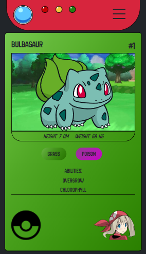
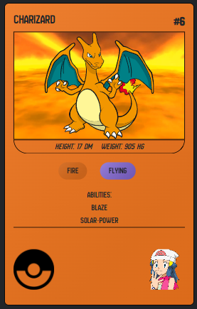
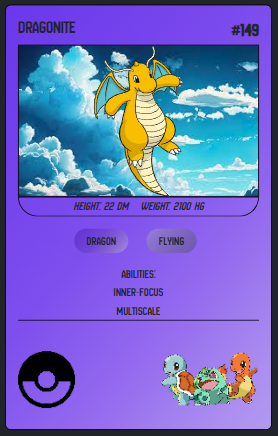
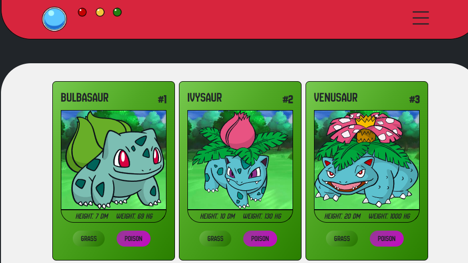
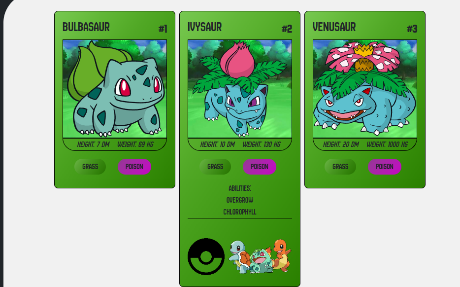
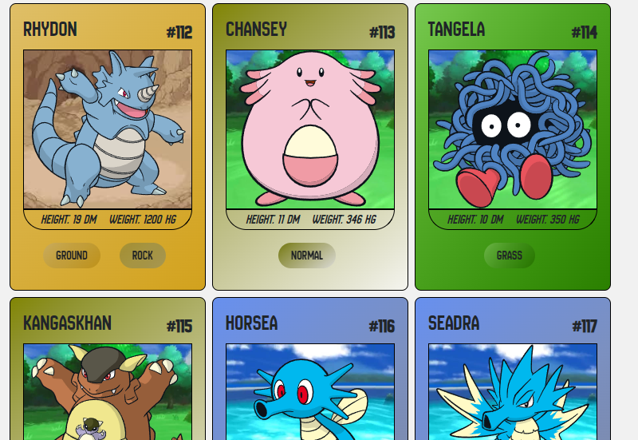
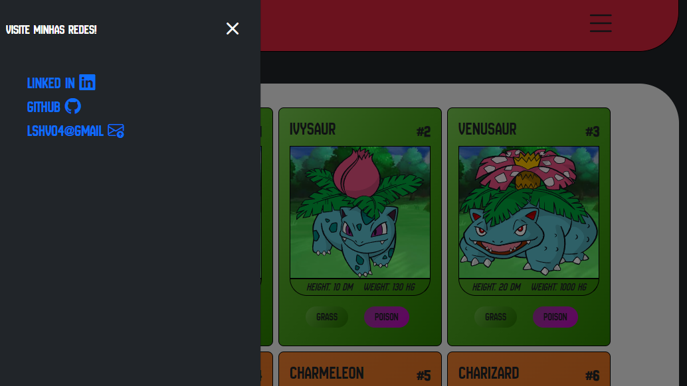

# Projeto Pessoal #10

Este projeto é um site de portfólio pessoal desenvolvido com o objetivo de realizar o desafio da [DIO](https://web.dio.me/track/formacao-javascript-developer)  a fim de consumir api no site [Pokeapi](https://pokeapi.co/), e utilizar o front-end para estilizar e alimentar o projeto dinamicamente.

Vários itens dos cards foram adicionados dinamicamente com base nas informações consumidas da API. Alguns exemplos são: cor de fundo, imagem de fundo, ID, nome, altura, peso e habilidades.

Excelente oportunidade para praticar minhas habilidades em JavaScript e utilizar o método Fetch API. Também tive a oportunidade de trabalhar com depuração de código e melhorias contínuas.  

## ✔️ Técnicas e tecnologias utilizadas  
**HTML5**: Para a marcação semântica do conteúdo.  
**CSS3**: Para estilização e layout,     
**Bootsstrap**: Para criação de grids e componentes.      
**Funções**: Criação de funções de cores e fontes para padronização e melhor manutenção do código.    
**Classes padronizadas**: Criação de classes reutilizáveis de botões, links e efeitos de hover para melhor manutenção e reutilização.    
**Media Query** : Criado múltiplos níveis para responsividade perfeita em múltiplas telas. 
**Javascript** :Para consumo de API e manipulação de HTML.  

  

https://github.com/user-attachments/assets/035af61d-5e26-4937-b14b-03f19813f735

  
  
   
  
   
   
 

 
 

  

      
## 📁 Acesso ao projeto  

[Veja o projeto final do curso em funcionamento](https://lshv04.github.io/Projetopessoal10/).  

Neste repositório você tem acesso a todo o material produzido no projeto.

